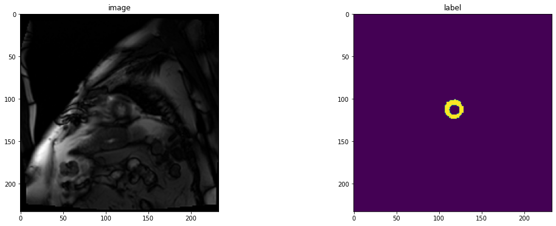
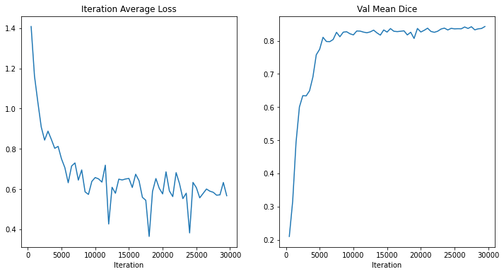

---
jupyter:
  kernelspec:
    display_name: Python 3.8.13 (\'Monai\')
    language: python
    name: python3
  language_info:
    codemirror_mode:
      name: ipython
      version: 3
    file_extension: .py
    mimetype: text/x-python
    name: python
    nbconvert_exporter: python
    pygments_lexer: ipython3
    version: 3.8.13
  nbformat: 4
  nbformat_minor: 4
  vscode:
    interpreter:
      hash: f62407cf952164ceff89595fc0bc65dadc4032aaa1b9dd51a62ca37c45ceae9b
---

::: {.cell .markdown}

# 3D Multi-organ Segmentation with Swin UNETR (BTCV Challenge) {#3d-multi-organ-segmentation-with-swin-unetr-btcv-challenge}

This tutorial uses a Swin UNETR \[1\] model for the task of multi-organ
segmentation task using the BTCV challenge dataset. The architecture of
Swin UNETR is demonstrated as below


The following features are included in this tutorial:

1.  Transforms for dictionary format data.
2.  Define a new transform according to MONAI transform API.
3.  Load Nifti image with metadata, load a list of images and stack
    them.
4.  Randomly adjust intensity for data augmentation.
5.  Cache IO and transforms to accelerate training and validation.
6.  Swin UNETR model, DiceCE loss function, Mean Dice metric for
    multi-organ segmentation task.

For this tutorial, the dataset needs to be downloaded from:
<https://www.synapse.org/#!Synapse:syn3193805/wiki/217752>.

In addition, the json file for data splits needs to be downloaded from
this
[link](https://drive.google.com/file/d/1t4fIQQkONv7ArTSZe4Nucwkk1KfdUDvW/view?usp=sharing).
Once downloaded, place the json file in the same folder as the dataset.

For BTCV dataset, under Institutional Review Board (IRB) supervision, 50
abdomen CT scans of were randomly selected from a combination of an
ongoing colorectal cancer chemotherapy trial, and a retrospective
ventral hernia study. The 50 scans were captured during portal venous
contrast phase with variable volume sizes (512 x 512 x 85 - 512 x 512 x 198) and field of views (approx. 280 x 280 x 280 mm3 - 500 x 500 x 650
mm3). The in-plane resolution varies from 0.54 x 0.54 mm2 to 0.98 x 0.98
mm2, while the slice thickness ranges from 2.5 mm to 5.0 mm.

Target: 13 abdominal organs including 1. Spleen 2. Right Kidney 3. Left
Kideny 4.Gallbladder 5.Esophagus 6. Liver 7. Stomach 8.Aorta 9. IVC 10.
Portal and Splenic Veins 11. Pancreas 12 Right adrenal gland 13 Left
adrenal gland.

Modality: CT Size: 30 3D volumes (24 Training + 6 Testing)\
Challenge: BTCV MICCAI Challenge

The following figure shows image patches with the organ sub-regions that
are annotated in the CT (top left) and the final labels for the whole
dataset (right).

Data, figures and resources are taken from:

1.  [Self-Supervised Pre-Training of Swin Transformers for 3D Medical
    Image Analysis](https://arxiv.org/abs/2111.14791)

2.  [Swin UNETR: Swin Transformers for Semantic Segmentation of Brain
    Tumors in MRI Images](https://arxiv.org/abs/2201.01266)

3.  [High-resolution 3D abdominal segmentation with random patch network
    fusion
    (MIA)](https://www.sciencedirect.com/science/article/abs/pii/S1361841520302589)

4.  [Efficient multi-atlas abdominal segmentation on clinically acquired
    CT with SIMPLE context learning
    (MIA)](https://www.sciencedirect.com/science/article/abs/pii/S1361841515000766?via%3Dihub)


The image patches show anatomies of a subject, including:

1.  large organs: spleen, liver, stomach.
2.  Smaller organs: gallbladder, esophagus, kidneys, pancreas.
3.  Vascular tissues: aorta, IVC, P&S Veins.
4.  Glands: left and right adrenal gland

If you find this tutorial helpful, please consider citing \[1\] and
[2](Hatamizadeh,%20A.,%20Nath,%20V.,%20Tang,%20Y.,%20Yang,%20D.,%20Roth,%20H.%20and%20Xu,%20D.,%202022.%20Swin%20UNETR:%20Swin%20Transformers%20for%20Semantic%20Segmentation%20of%20Brain%20Tumors%20in%20MRI%20Images.%20arXiv%20preprint%20arXiv:2201.01266.):

\[1\]: Tang, Y., Yang, D., Li, W., Roth, H.R., Landman, B., Xu, D.,
Nath, V. and Hatamizadeh, A., 2022. Self-supervised pre-training of swin
transformers for 3d medical image analysis. In Proceedings of the
IEEE/CVF Conference on Computer Vision and Pattern Recognition (pp.
20730-20740).

[](https://colab.research.google.com/github/Project-MONAI/tutorials/blob/main/3d_segmentation/swin_unetr_btcv_segmentation_3d.ipynb)
:::

::: {.cell .markdown}

# Pre-trained Swin UNETR Encoder

We use weights from self-supervised pre-training of Swin UNETR encoder
(3D Swin Tranformer) on a cohort of 5050 CT scans from publicly
available datasets. The encoder is pre-trained using reconstructin,
rotation prediction and contrastive learning pre-text tasks as shown
below. For more details, please refer to \[1\] (CVPR paper) and see this
[repository](https://github.com/Project-MONAI/research-contributions/tree/main/SwinUNETR/Pretrain).


Please download the pre-trained weights from this
[link](https://github.com/Project-MONAI/MONAI-extra-test-data/releases/download/0.8.1/model_swinvit.pt)
and place it in the root directory of this tutorial.

If training from scratch is desired, please skip the step for
initializing from pre-trained weights.
:::

::: {.cell .markdown}

## Setup environment

:::

::: {.cell .code}

```{.python}
!pip install git+https://github.com/Project-MONAI/MONAI#egg.gitmonai@0.8.1+271.g07de215c
!pip install nibabel==3.1.1
!pip install tqdm==4.63.0
```

:::

::: {.cell .code execution_count="1"}

```{.python}
!python -c "import matplotlib" || pip install -q matplotlib
%matplotlib inline
```

:::

::: {.cell .code execution_count="2"}

```{.python}
import os
import shutil
import tempfile

import matplotlib.pyplot as plt
import numpy as np
from tqdm import tqdm

from monai.losses import DiceCELoss
from monai.inferers import sliding_window_inference
from monai.transforms import (
    AsDiscrete,
    AddChanneld,
    Compose,
    CropForegroundd,
    LoadImaged,
    Orientationd,
    RandFlipd,
    RandCropByPosNegLabeld,
    RandShiftIntensityd,
    ScaleIntensityRanged,
    Spacingd,
    RandRotate90d,
    ToTensord,
)

from monai.config import print_config
from monai.metrics import DiceMetric
from monai.networks.nets import SwinUNETR

from monai.data import (
    DataLoader,
    CacheDataset,
    load_decathlon_datalist,
    decollate_batch,
)


import torch

print_config()
```

::: {.output .stream .stdout}
MONAI version: 0.9.0+29.gb45794ab
Numpy version: 1.23.0
Pytorch version: 1.8.2+cu102
MONAI flags: HAS_EXT = False, USE_COMPILED = False
MONAI rev id: b45794ab42b29fd01634396f99821d322d6e065b
MONAI **file**: d:\ANACONDA\envs\Monai\lib\site-packages\monai\_\_init\_\_.py

    Optional dependencies:
    Pytorch Ignite version: NOT INSTALLED or UNKNOWN VERSION.
    Nibabel version: 3.1.1
    scikit-image version: NOT INSTALLED or UNKNOWN VERSION.
    Pillow version: 9.2.0
    Tensorboard version: NOT INSTALLED or UNKNOWN VERSION.
    gdown version: NOT INSTALLED or UNKNOWN VERSION.
    TorchVision version: 0.9.2+cu102
    tqdm version: 4.63.0
    lmdb version: NOT INSTALLED or UNKNOWN VERSION.
    psutil version: 5.9.1
    pandas version: NOT INSTALLED or UNKNOWN VERSION.
    einops version: NOT INSTALLED or UNKNOWN VERSION.
    transformers version: NOT INSTALLED or UNKNOWN VERSION.
    mlflow version: NOT INSTALLED or UNKNOWN VERSION.
    pynrrd version: NOT INSTALLED or UNKNOWN VERSION.

    For details about installing the optional dependencies, please visit:
        https://docs.monai.io/en/latest/installation.html#installing-the-recommended-dependencies

:::
:::

::: {.cell .markdown}

## Setup data directory

You can specify a directory with the `MONAI_DATA_DIRECTORY` environment
variable.\
This allows you to save results and reuse downloads.\
If not specified a temporary directory will be used.
:::

::: {.cell .code execution_count="3"}

```{.python}
directory = "./" #os.environ.get("MONAI_DATA_DIRECTORY")
root_dir = tempfile.mkdtemp() if directory is None else directory
print(root_dir)
```

::: {.output .stream .stdout}
./
:::
:::

::: {.cell .markdown}

## Setup transforms for training and validation

To save on GPU memory utilization, the num_samples can be reduced to 2.
:::

::: {.cell .code execution_count="4"}

```{.python}
num_samples = 4

train_transforms = Compose(
    [
        LoadImaged(keys=["image", "label"]),
        AddChanneld(keys=["image", "label"]),
        Orientationd(keys=["image", "label"], axcodes="RAS"),
        Spacingd(
            keys=["image", "label"],
            pixdim=(1.5, 1.5, 2.0),
            mode=("bilinear", "nearest"),
        ),
        ScaleIntensityRanged(
            keys=["image"],
            a_min=-175,
            a_max=250,
            b_min=0.0,
            b_max=1.0,
            clip=True,
        ),
        CropForegroundd(keys=["image", "label"], source_key="image"),
        RandCropByPosNegLabeld(
            keys=["image", "label"],
            label_key="label",
            spatial_size=(96, 96, 96),
            pos=1,
            neg=1,
            num_samples=num_samples,
            image_key="image",
            image_threshold=0,
        ),
        RandFlipd(
            keys=["image", "label"],
            spatial_axis=[0],
            prob=0.10,
        ),
        RandFlipd(
            keys=["image", "label"],
            spatial_axis=[1],
            prob=0.10,
        ),
        RandFlipd(
            keys=["image", "label"],
            spatial_axis=[2],
            prob=0.10,
        ),
        RandRotate90d(
            keys=["image", "label"],
            prob=0.10,
            max_k=3,
        ),
        RandShiftIntensityd(
            keys=["image"],
            offsets=0.10,
            prob=0.50,
        ),
        ToTensord(keys=["image", "label"]),
    ]
)
val_transforms = Compose(
    [
        LoadImaged(keys=["image", "label"]),
        AddChanneld(keys=["image", "label"]),
        Orientationd(keys=["image", "label"], axcodes="RAS"),
        Spacingd(
            keys=["image", "label"],
            pixdim=(1.5, 1.5, 2.0),
            mode=("bilinear", "nearest"),
        ),
        ScaleIntensityRanged(
            keys=["image"], a_min=-175, a_max=250, b_min=0.0, b_max=1.0, clip=True
        ),
        CropForegroundd(keys=["image", "label"], source_key="image"),
        ToTensord(keys=["image", "label"]),
    ]
)
```

:::

::: {.cell .markdown}
\#\# Download dataset and format in the folder. 1. Download dataset from
here:
[https://www.synapse.org/\#!Synapse:syn3193805/wiki/89480\\n](https://www.synapse.org/#!Synapse:syn3193805/wiki/89480\n){.uri} 2. Put images in the ./data/imagesTr 3. Put labels in the
./data/labelsTr 4. make JSON file accordingly: ./data/dataset_0.json
Example of JSON file: { \"description\": \"btcv yucheng\", \"labels\": {
\"0\": \"background\", \"1\": \"spleen\", \"2\": \"rkid\", \"3\":
\"lkid\", \"4\": \"gall\", \"5\": \"eso\", \"6\": \"liver\", \"7\":
\"sto\", \"8\": \"aorta\", \"9\": \"IVC\", \"10\": \"veins\", \"11\":
\"pancreas\", \"12\": \"rad\", \"13\": \"lad\" }, \"licence\": \"yt\",
\"modality\": { \"0\": \"CT\" }, \"name\": \"btcv\", \"numTest\": 20,
\"numTraining\": 80, \"reference\": \"Vanderbilt University\",
\"release\": \"1.0 06/08/2015\", \"tensorImageSize\": \"3D\", \"test\":
\[ \"imagesTs/img0061.nii.gz\", \"imagesTs/img0062.nii.gz\",
\"imagesTs/img0063.nii.gz\", \"imagesTs/img0064.nii.gz\",
\"imagesTs/img0065.nii.gz\", \"imagesTs/img0066.nii.gz\",
\"imagesTs/img0067.nii.gz\", \"imagesTs/img0068.nii.gz\",
\"imagesTs/img0069.nii.gz\", \"imagesTs/img0070.nii.gz\",
\"imagesTs/img0071.nii.gz\", \"imagesTs/img0072.nii.gz\",
\"imagesTs/img0073.nii.gz\", \"imagesTs/img0074.nii.gz\",
\"imagesTs/img0075.nii.gz\", \"imagesTs/img0076.nii.gz\",
\"imagesTs/img0077.nii.gz\", \"imagesTs/img0078.nii.gz\",
\"imagesTs/img0079.nii.gz\", \"imagesTs/img0080.nii.gz\" \],
\"training\": \[ { \"image\": \"imagesTr/img0001.nii.gz\", \"label\":
\"labelsTr/label0001.nii.gz\" }, { \"image\":
\"imagesTr/img0002.nii.gz\", \"label\": \"labelsTr/label0002.nii.gz\" },
{ \"image\": \"imagesTr/img0003.nii.gz\", \"label\":
\"labelsTr/label0003.nii.gz\" }, { \"image\":
\"imagesTr/img0004.nii.gz\", \"label\": \"labelsTr/label0004.nii.gz\" },
{ \"image\": \"imagesTr/img0005.nii.gz\", \"label\":
\"labelsTr/label0005.nii.gz\" }, { \"image\":
\"imagesTr/img0006.nii.gz\", \"label\": \"labelsTr/label0006.nii.gz\" },
{ \"image\": \"imagesTr/img0007.nii.gz\", \"label\":
\"labelsTr/label0007.nii.gz\" }, { \"image\":
\"imagesTr/img0008.nii.gz\", \"label\": \"labelsTr/label0008.nii.gz\" },
{ \"image\": \"imagesTr/img0009.nii.gz\", \"label\":
\"labelsTr/label0009.nii.gz\" }, { \"image\":
\"imagesTr/img0010.nii.gz\", \"label\": \"labelsTr/label0010.nii.gz\" },
{ \"image\": \"imagesTr/img0021.nii.gz\", \"label\":
\"labelsTr/label0021.nii.gz\" }, { \"image\":
\"imagesTr/img0022.nii.gz\", \"label\": \"labelsTr/label0022.nii.gz\" },
{ \"image\": \"imagesTr/img0023.nii.gz\", \"label\":
\"labelsTr/label0023.nii.gz\" }, { \"image\":
\"imagesTr/img0024.nii.gz\", \"label\": \"labelsTr/label0024.nii.gz\" },
{ \"image\": \"imagesTr/img0025.nii.gz\", \"label\":
\"labelsTr/label0025.nii.gz\" }, { \"image\":
\"imagesTr/img0026.nii.gz\", \"label\": \"labelsTr/label0026.nii.gz\" },
{ \"image\": \"imagesTr/img0027.nii.gz\", \"label\":
\"labelsTr/label0027.nii.gz\" }, { \"image\":
\"imagesTr/img0028.nii.gz\", \"label\": \"labelsTr/label0028.nii.gz\" },
{ \"image\": \"imagesTr/img0029.nii.gz\", \"label\":
\"labelsTr/label0029.nii.gz\" }, { \"image\":
\"imagesTr/img0030.nii.gz\", \"label\": \"labelsTr/label0030.nii.gz\" },
{ \"image\": \"imagesTr/img0031.nii.gz\", \"label\":
\"labelsTr/label0031.nii.gz\" }, { \"image\":
\"imagesTr/img0032.nii.gz\", \"label\": \"labelsTr/label0032.nii.gz\" },
{ \"image\": \"imagesTr/img0033.nii.gz\", \"label\":
\"labelsTr/label0033.nii.gz\" }, { \"image\":
\"imagesTr/img0034.nii.gz\", \"label\": \"labelsTr/label0034.nii.gz\" }
\], \"validation\": \[ { \"image\": \"imagesTr/img0035.nii.gz\",
\"label\": \"labelsTr/label0035.nii.gz\" }, { \"image\":
\"imagesTr/img0036.nii.gz\", \"label\": \"labelsTr/label0036.nii.gz\" },
{ \"image\": \"imagesTr/img0037.nii.gz\", \"label\":
\"labelsTr/label0037.nii.gz\" }, { \"image\":
\"imagesTr/img0038.nii.gz\", \"label\": \"labelsTr/label0038.nii.gz\" },
{ \"image\": \"imagesTr/img0039.nii.gz\", \"label\":
\"labelsTr/label0039.nii.gz\" }, { \"image\":
\"imagesTr/img0040.nii.gz\", \"label\": \"labelsTr/label0040.nii.gz\" }
\] }
:::

::: {.cell .code}

```{.python}
from os import listdir
from os.path import isfile, join

path_data = "./data/labelsTr"
onlyfiles = [f for f in listdir(path_data) if isfile(join(path_data, f))]
json = [{"image": f"imagesTr/{f.replace('_seg', '')}", "label": f"labelsTr/{f}"} for f in onlyfiles]
json
```

:::

::: {.cell .code execution_count="27"}

```{.python}
path_data = "./data/imagesTs"
onlyfiles = [f for f in listdir(path_data) if isfile(join(path_data, f))]
onlyfiles
```

::: {.output .execute_result execution_count="27"}
['det0000301_avg.nii.gz',
'det0000601_avg.nii.gz',
'det0000701_avg.nii.gz',
'det0007301_avg.nii.gz',
'det0007401_avg.nii.gz',
'det0007501_avg.nii.gz',
'det0007601_avg.nii.gz',
'det0007801_avg.nii.gz',
'det0008301_avg.nii.gz',
'det0008501_avg.nii.gz',
'det0008601_avg.nii.gz',
'det0008701_avg.nii.gz',
'det0009101_avg.nii.gz',
'det0009401_avg.nii.gz',
'det0009501_avg.nii.gz',
'det0009701_avg.nii.gz',
'det0010001_avg.nii.gz',
'det0010201_avg.nii.gz',
'det0010401_avg.nii.gz',
'det0010501_avg.nii.gz',
'det0010701_avg.nii.gz',
'det0010801_avg.nii.gz',
'det0010901_avg.nii.gz',
'det0011201_avg.nii.gz',
'det0011301_avg.nii.gz',
'det0011401_avg.nii.gz',
'det0011501_avg.nii.gz',
'det0011601_avg.nii.gz',
'det0011701_avg.nii.gz',
'det0012001_avg.nii.gz',
'det0012101_avg.nii.gz',
'det0012201_avg.nii.gz',
'det0012401_avg.nii.gz',
'det0012501_avg.nii.gz',
'det0012901_avg.nii.gz',
'det0013001_avg.nii.gz',
'det0013101_avg.nii.gz',
'det0013301_avg.nii.gz',
'det0013401_avg.nii.gz',
'det0013801_avg.nii.gz',
'det0014001_avg.nii.gz',
'det0014401_avg.nii.gz',
'det0014501_avg.nii.gz',
'det0014601_avg.nii.gz',
'det0014701_avg.nii.gz',
'det0014801_avg.nii.gz',
'det0014901_avg.nii.gz',
'det0015001_avg.nii.gz',
'det0015101_avg.nii.gz',
'det0015501_avg.nii.gz',
'det0019401_avg.nii.gz',
'det0020201_avg.nii.gz',
'det0021401_avg.nii.gz',
'det0024301_avg.nii.gz',
'det0025001_avg.nii.gz',
'det0026201_avg.nii.gz',
'det0026601_avg.nii.gz',
'det0026701_avg.nii.gz',
'det0027601_avg.nii.gz',
'det0029201_avg.nii.gz',
'det0029301_avg.nii.gz',
'det0029601_avg.nii.gz',
'det0029901_avg.nii.gz',
'det0030301_avg.nii.gz',
'det0035301_avg.nii.gz',
'det0042201_avg.nii.gz',
'det0042301_avg.nii.gz',
'det0042701_avg.nii.gz',
'det0043001_avg.nii.gz',
'det0043301_avg.nii.gz',
'det0044001_avg.nii.gz',
'det0044901_avg.nii.gz',
'synapse_metadata_manifest.tsv']
:::
:::

::: {.cell .code execution_count="5"}

```{.python}
data_dir = "./data/"
split_JSON = "dataset_0.json"

datasets = data_dir + split_JSON
datalist = load_decathlon_datalist(datasets, True, "training")
val_files = load_decathlon_datalist(datasets, True, "validation")
train_ds = CacheDataset(
    data=datalist,
    transform=train_transforms,
    cache_num=24,
    cache_rate=1.0,
    num_workers=8,
)
train_loader = DataLoader(
    train_ds, batch_size=1, shuffle=True, num_workers=8, pin_memory=True
)
val_ds = CacheDataset(
    data=val_files, transform=val_transforms, cache_num=6, cache_rate=1.0, num_workers=4
)
val_loader = DataLoader(
    val_ds, batch_size=1, shuffle=False, num_workers=4, pin_memory=True
)
```

::: {.output .stream .stderr}
Loading dataset: 100%|██████████| 24/24 [00:11<00:00, 2.10it/s]
Loading dataset: 100%|██████████| 6/6 [00:02<00:00, 2.47it/s]
:::
:::

::: {.cell .markdown}

## Check data shape and visualize

:::

::: {.cell .code execution_count="9"}

```{.python}
slice_map = {
    "det0042401_avg.nii.gz": 170,
    "det0042501_avg.nii.gz": 2,
    "det0042601_avg.nii.gz": 3,
    "det0043101_avg.nii.g": 4,
    "det0043201_avg.nii.gz": 5,
    "det0044601_avg.nii.gz": 180,
}
case_num = 2
img_name = os.path.split(val_ds[case_num]["image_meta_dict"]["filename_or_obj"])[1]
img = val_ds[case_num]["image"]
label = val_ds[case_num]["label"]
img_shape = img.shape
label_shape = label.shape
print(f"image shape: {img_shape}, label shape: {label_shape}")
plt.figure("image", (18, 6))
plt.subplot(1, 2, 1)
plt.title("image")
plt.imshow(img[0, :, :, slice_map[img_name]].detach().cpu(), cmap="gray")
plt.subplot(1, 2, 2)
plt.title("label")
plt.imshow(label[0, :, :, slice_map[img_name]].detach().cpu())
plt.show()
```

::: {.output .stream .stdout}
image shape: torch.Size([1, 233, 233, 31]), label shape: torch.Size([1, 233, 233, 31])
:::

::: {.output .display_data}

:::
:::

::: {.cell .markdown}

### Create Swin UNETR model

In this scetion, we create Swin UNETR model for the 14-class multi-organ
segmentation. We use a feature size of 48 which is compatible with
self-supervised pre-trained weights. We also use gradient checkpointing
(use_checkpoint) for more memory-efficient training.
:::

::: {.cell .code execution_count="10"}

```{.python}
torch.cuda.is_available()
```

::: {.output .execute_result execution_count="10"}
True
:::
:::

::: {.cell .code execution_count="38"}

```{.python}
os.environ["CUDA_DEVICE_ORDER"] = "PCI_BUS_ID"
device = torch.device("cuda" if torch.cuda.is_available() else "cpu")

model = SwinUNETR(
    img_size=(96, 96, 96),
    in_channels=1,
    out_channels=14,
    feature_size=48,
    use_checkpoint=True,
).to(device)
```

:::

::: {.cell .markdown}

### Initialize Swin UNETR encoder from self-supervised pre-trained weights

In this section, we intialize the Swin UNETR encoder from weights
downloaded from this
[link](https://github.com/Project-MONAI/MONAI-extra-test-data/releases/download/0.8.1/model_swinvit.pt).
If training from scratch is desired, please skip this section.
:::

::: {.cell .code execution_count="39"}

```{.python}
weight = torch.load("./weights/model_swinvit.pt")
model.load_from(weights=weight)
print("Using pretrained self-supervied Swin UNETR backbone weights !")
```

::: {.output .stream .stdout}
Using pretrained self-supervied Swin UNETR backbone weights !
:::
:::

::: {.cell .markdown}

### Optimizer and loss function

:::

::: {.cell .code execution_count="40"}

```{.python}
torch.backends.cudnn.benchmark = True
loss_function = DiceCELoss(to_onehot_y=True, softmax=True)
optimizer = torch.optim.AdamW(model.parameters(), lr=1e-4, weight_decay=1e-5)
```

:::

::: {.cell .markdown}

### Execute a typical PyTorch training process

:::

::: {.cell .code execution_count="41" scrolled="true"}

```{.python}
def validation(epoch_iterator_val):
    model.eval()
    with torch.no_grad():
        for step, batch in enumerate(epoch_iterator_val):
            val_inputs, val_labels = (batch["image"].cuda(), batch["label"].cuda())
            val_outputs = sliding_window_inference(val_inputs, (96, 96, 96), 4, model)
            val_labels_list = decollate_batch(val_labels)
            val_labels_convert = [
                post_label(val_label_tensor) for val_label_tensor in val_labels_list
            ]
            val_outputs_list = decollate_batch(val_outputs)
            val_output_convert = [
                post_pred(val_pred_tensor) for val_pred_tensor in val_outputs_list
            ]
            dice_metric(y_pred=val_output_convert, y=val_labels_convert)
            epoch_iterator_val.set_description(
                "Validate (%d / %d Steps)" % (global_step, 10.0)
            )
        mean_dice_val = dice_metric.aggregate().item()
        dice_metric.reset()
    return mean_dice_val


def train(global_step, train_loader, dice_val_best, global_step_best):
    model.train()
    epoch_loss = 0
    step = 0
    epoch_iterator = tqdm(
        train_loader, desc="Training (X / X Steps) (loss=X.X)", dynamic_ncols=True
    )
    for step, batch in enumerate(epoch_iterator):
        step += 1
        x, y = (batch["image"].cuda(), batch["label"].cuda())
        logit_map = model(x)
        loss = loss_function(logit_map, y)
        loss.backward()
        epoch_loss += loss.item()
        optimizer.step()
        optimizer.zero_grad()
        epoch_iterator.set_description(
            "Training (%d / %d Steps) (loss=%2.5f)"
            % (global_step, max_iterations, loss)
        )
        if (
            global_step % eval_num == 0 and global_step != 0
        ) or global_step == max_iterations:
            epoch_iterator_val = tqdm(
                val_loader, desc="Validate (X / X Steps) (dice=X.X)", dynamic_ncols=True
            )
            dice_val = validation(epoch_iterator_val)
            epoch_loss /= step
            epoch_loss_values.append(epoch_loss)
            metric_values.append(dice_val)
            if dice_val > dice_val_best:
                dice_val_best = dice_val
                global_step_best = global_step
                torch.save(
                    model.state_dict(), os.path.join(root_dir, "weights", "best_metric_model.pth")
                )
                print(
                    "Model Was Saved ! Current Best Avg. Dice: {} Current Avg. Dice: {}".format(
                        dice_val_best, dice_val
                    )
                )
            else:
                print(
                    "Model Was Not Saved ! Current Best Avg. Dice: {} Current Avg. Dice: {}".format(
                        dice_val_best, dice_val
                    )
                )
        global_step += 1
    return global_step, dice_val_best, global_step_best


max_iterations = 30000
eval_num = 500
post_label = AsDiscrete(to_onehot=14)
post_pred = AsDiscrete(argmax=True, to_onehot=14)
dice_metric = DiceMetric(include_background=True, reduction="mean", get_not_nans=False)
global_step = 0
dice_val_best = 0.0
global_step_best = 0
epoch_loss_values = []
metric_values = []

while global_step < max_iterations:
    global_step, dice_val_best, global_step_best = train(
        global_step, train_loader, dice_val_best, global_step_best
    )

model.load_state_dict(torch.load(os.path.join(root_dir, "weights", "best_metric_model.pth")))
```

::: {.output .stream .stderr}
Training (X / X Steps) (loss=X.X): 0%| | 0/77 [00:00<?, ?it/s]
:::
:::

::: {.cell .code execution_count="11"}

```{.python}
print(
    f"train completed, best_metric: {dice_val_best:.4f} "
    f"at iteration: {global_step_best}"
)
```

::: {.output .stream .stdout}
train completed, best_metric: 0.8430 at iteration: 29500
:::
:::

::: {.cell .markdown}

### Plot the loss and metric

:::

::: {.cell .code execution_count="12"}

```{.python}
plt.figure("train", (12, 6))
plt.subplot(1, 2, 1)
plt.title("Iteration Average Loss")
x = [eval_num * (i + 1) for i in range(len(epoch_loss_values))]
y = epoch_loss_values
plt.xlabel("Iteration")
plt.plot(x, y)
plt.subplot(1, 2, 2)
plt.title("Val Mean Dice")
x = [eval_num * (i + 1) for i in range(len(metric_values))]
y = metric_values
plt.xlabel("Iteration")
plt.plot(x, y)
plt.show()
```

::: {.output .display_data}

:::
:::

::: {.cell .markdown}

### Check best model output with the input image and label

:::

::: {.cell .code execution_count="13"}

```{.python}
case_num = 4
model.load_state_dict(torch.load(os.path.join(root_dir, "weights", "best_metric_model.pth")))
model.eval()
with torch.no_grad():
    img_name = os.path.split(val_ds[case_num]["image_meta_dict"]["filename_or_obj"])[1]
    img = val_ds[case_num]["image"]
    label = val_ds[case_num]["label"]
    val_inputs = torch.unsqueeze(img, 1).cuda()
    val_labels = torch.unsqueeze(label, 1).cuda()
    val_outputs = sliding_window_inference(
        val_inputs, (96, 96, 96), 4, model, overlap=0.8
    )
    plt.figure("check", (18, 6))
    plt.subplot(1, 3, 1)
    plt.title("image")
    plt.imshow(val_inputs.cpu().numpy()[0, 0, :, :, slice_map[img_name]], cmap="gray")
    plt.subplot(1, 3, 2)
    plt.title("label")
    plt.imshow(val_labels.cpu().numpy()[0, 0, :, :, slice_map[img_name]])
    plt.subplot(1, 3, 3)
    plt.title("output")
    plt.imshow(
        torch.argmax(val_outputs, dim=1).detach().cpu()[0, :, :, slice_map[img_name]]
    )
    plt.show()
```

::: {.output .display_data}

:::
:::

::: {.cell .markdown}

### Cleanup data directory

Remove directory if a temporary was used.
:::

::: {.cell .code execution_count="12"}

```{.python}
if directory is None:
    shutil.rmtree(root_dir)
```

:::
