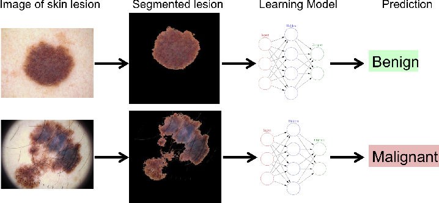

<h2 align="center">

Detección temprana del melanoma mediante un sistema
end-to-end basado en redes Vision Transformer 👁️🤖

</h2>

## 📑 Resumen

El trabajo consiste en la creación y entrenamiento de un modelo multi-tarea basado en Trans-UNet y DeiT con el fin de comparar su rendimiento versus enfoques basados en etapas. Se entraron 3 variantes:

* **seg_cls_init.** Consiste en agregar una red DeiT de forma paralela a la red Trans-UNet. Ambas reciben la misma entrada.
* **seg_cls_middle.** Consiste en agregar la salida del espacio latente *Z* de la red Trans-UNet como entrada al clasificador DeiT. 
* **seg_cls_masking.** La porción de la imagen original que ha sido seleccionada por la máscara de segmentación resultante de la red Trans-UNet servirá como entrada al clasificador DeiT.

## 🖼️ Detalles

    

        
        <h4>Resumen de la tarea a resolver</h4>
    

     
    

        
        <h4>Segmentación sobre datos de prueba. Filas: (a) Imágenes originales (b) Mapa
de segmentación objetivo (c) Segmentación generada por <b>seg_cls_init</b> (d) Segmentación
generada por <b>seg_cls_middle</b> (e) Segmentación generada por <b>seg_cls_masking</b>. Se
observa que el enfoque con la segmentación más precisa es <b>seg_cls_init</b> y el enfoque con
la segmentación menos coherente es <b>seg_cls_middle</b>. Fuente: elaboración propia. </h4>
    

